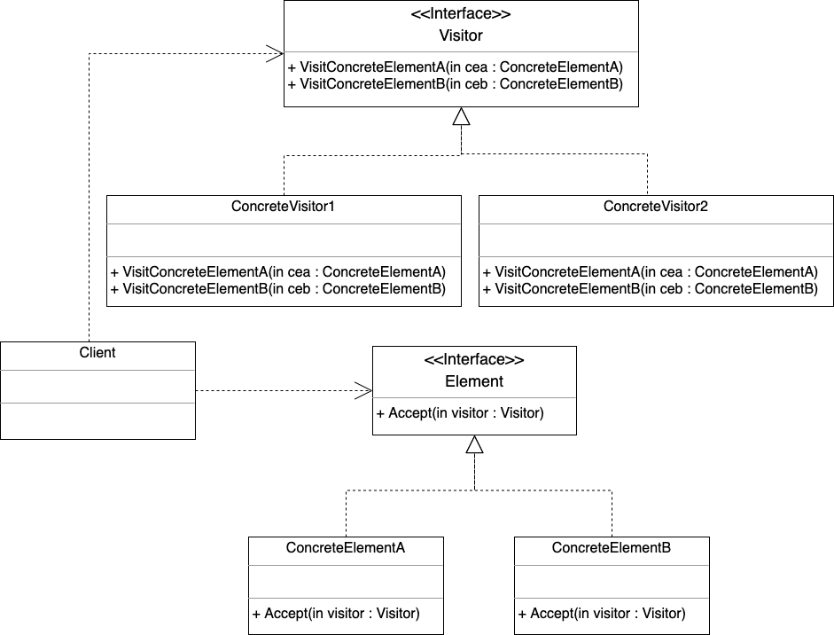

## 访问者模式

### 定义

访问者模式(Visitor):表示一个作用于某对象结构中的各元素的操作。它使你可以在不改变元素类的前提下定义作用于这些元素的新操作。

使用访问者模式，元素的执行算法可以随着访问者改变而改变。主要意图是将数据结构与数据操作分离。

不过作为比较难理解的设计模式之一，因为它难理解、难实现，应用它会导致代码的可读性、可维护性变差，所以，访问者模式在实际的软件开发中很少被用到，在没有特别必要的情况下，访问者模式是不建议使用的。

### 优点

1、开闭原则。 你可以引入在不同类对象上执行的新行为， 且无需对这些类做出修改。

2、单一职责原则。 可将同一行为的不同版本移到同一个类中。

3、灵活性更好。

### 缺点

1、具体元素变更比较困难。每次在元素层次结构中添加或移除一个类时，都要更新所有的访问者。

2、比较难理解，应用它会导致代码的可读性、可维护性变差。

### 适用范围

1、对象结构中对象对应的类很少改变，但经常需要在此对象结构上定义新的操作。

2、需要对一个对象结构中的对象进行很多不同的并且不相关的操作，而需要避免让这些操作"污染"这些对象的类，也不希望在增加新操作时修改这些类。

### 举例类图

